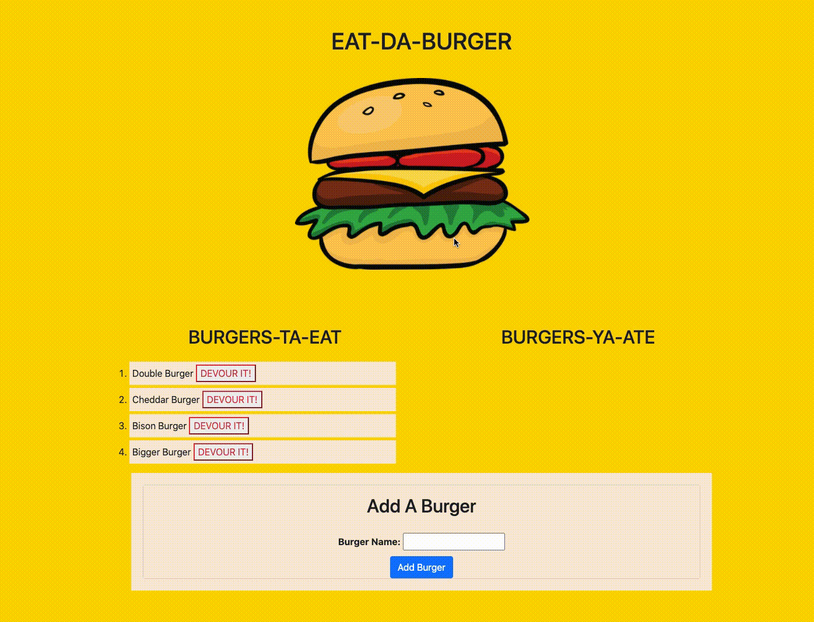

  # Eat-Da-Burger 
  
  ## Description
    Eat-Da-Burger is an app that lets users input the names of burgers they'd like to eat. Once the burger has been added, a button to the right appears that allows them to devour their burger. Once devoured, it will appear in the right-hand column. Thei app uses MySql, express, and express-handlebars to dynamically update the app. 

  ## Table of Contents
  - [Installation](#installation)
  - [Usage](#usage)
  - [License](#license)
  - [Tests](#tests)
  - [Contributors](#contributors)
- [Demonstration](#demonstration)

  ## Installation
  Packages required to run this program are: npm i, npm my-sql, npm express, npm express-handlebars
  
  ## Usage
  Examples of how to use this program: n/a

  ## License
  None

  ## Tests
  To test, run the following command: node server.js

  ## Contributors
  John Garcia

## Demonstration

  ## Contact
  
 
  

  
https://github.com/johngarcia144
  
If you have any questions, contact the author directly at john.garcia144@gmail.com.
 